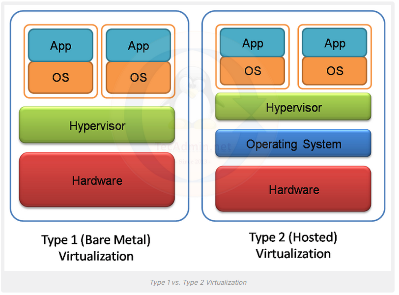

## Notions
Hyperviseur qui crée un environnement matériel virtualisé 
proxmox : outil de virtualisation au format ISO
VM : Linux et windows possible - mise en place d'un switch virtuel basic qui connecte les machine. 
Conainerisation: linux et windows pas possible (doker) -> WSL: c'est une 

Interfaces réseaux virtuelles - 
Emulation 
Emuler sur une machine, une console de jeu c'est possible
Para-Virtualisation : un driver qui accéde aux ressources sans les avoir virtuellement. 

## Type de virtualisation
**Virtualisation** Type1 (bare metal) on utilise dans l'industrie (VMware - hyperV). 
**Virtualisation** type2 (hosted ) on utilise dans les pc perso, utilisation personnelle.

Lorsque les calculs sont nombreux : il vaut mieux ne pas virtualiser car on a besoin de beaucoup de ressources 

## Avantage de la virtualisation:
Moins de Consommation de l'énérgie 
Maintenance 
acquisition 
optimisation des ressources 
possibilité de maintien de vieux systèmes incompatibles avec les nouvelles générations de matériel 
Déplacement des serveurs d'un continent à un autre grâce à la virtualisation pour réduire les coûts 
La virtualisation touche tous les domaines de l'informatique 

## Inconvénients:
recours à des machines puissantes
mise en oeuvre plus délicate, administration
Attention au SPOF (single point of failure)
Performances réduites si le CPU doit être émulé
Parfois inadapté -> exemple : s'il y a beaucoup d'entrées et de sorties Inpu/output 

## TP:
Nous allons utilisé KVM pou r la virtualisation : C'est une virtualisation de type1 
on va utilisé QEMU pour émuler plusieurs processeurs 
on va rajouter Libvirt : librairie virtuelles 
integration avec des outils graphiques
Snapshot : il permet de réaliser une **photo ** 
live migration : migration à chaud - migration : déplacement d'une VM sans l'arrêter 

