# TP Systèmes d'Exploitation
L'ensemble des commandes tapées en mode CLI et leurs résultats sont requis. Un document au format texte (réalisé par exemple sous gedit) reprenant les numéros des  que>

L'objectif du TP est de se familiariser avec quelques commandes essentielles pour gérer et tester des configurations réseaux simples sous Linux.

## 0/ Prérequis:

Machine physique sous Ubuntu 22,04, possédant une interface Ethernet, accès Internet pour installation initiale des packages.

**Ce TP est réalisé grâce à deux machines complétement isolées, sur VirtualBox**

Passer root dans un terminal et installer les packages suivants via la commande :

`apt install -y ethtool wireshark nmap nc openssh-server etherape` : **_Installés_**

L'ensemble des **RFCs 1918** et **3927** ont été récupèrès grâce aux commandes suivantes :

**wget https://www.ietf.org/rfc/rfc1918.txt**

**wget https://www.ietf.org/rfc/rfc3927.txt**


**Désactivation du wifi:**

Les services « réseaux » ont été stoppés avec les commandes suivantes:

```
		systemctl mask avahi-daemon ;
                systemctl stop ufw ;
		systemctl stop NetworkManager
		nmcli radio wifi off
```

## 1/ Niveaux 1 et 2

**1.1 Création des « îlots » de connectivité en raccordant sur un switch (ou un hub) les machines via des câbles RJ45. Veillez à conserver, a minima, une prise RJ45 disponible sur l'équipement réseau.**

- Les deux machines sont en mode **Réseau interne** dans **VirtualBox** afin de pouvoir réaliser le TP.

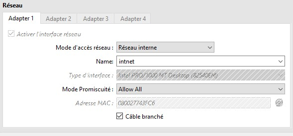


* * *

**1.2 Rappeler très brièvement les différences entre un switch et un hub**

- **Un hub** diffuse les données à tous les appareils connectés, ce qui est moins efficace et moins sécurisé.

- **Un switch** envoie les données uniquement à l'appareil destinataire, ce qui est plus efficace et plus sécurisé.


_**Les switches** ont largement remplacé **les hubs** dans les réseaux modernes en raison de leurs avantages en termes de performance et de **sécurité**._

* * *

**1.3 Les machines d'un îlot peuvent-elles communiquer entre elles ?**

- Oui, les machines d'un îlot (ou segment de réseau) peuvent communiquer entre elles, à condition qu'elles soient correctement configurées et connectées.

* * *

**1.4 Vérification et promosition des commandes.**

- Nous pouvons vérifier la connectivité entre deux machines avec la commande **ping adresse IP de la machine distante** pour pouvoir procéder à cette vérification il est important de :

	- Désactiver le pare-feu avec la commande : `sudo ufw disable` ou `systemctl ufw stop` pour le désactiver uniquement.

	  ou

	-  Autoriser le trafic entre les machines avec la commande `sudo ufw allow from <adresse_IP_de_la machine_distante>`

 La commande **ip link** liste les interfaces réseaux, repérer l'interface Ethernet, des machines, notez son nom et son adresse Ethernet.


* * *

**1.5 La commande **ethtool** permet de vérifier/modifier de nombreux paramètres d'une interface Ethernet. Appliquer cette commande à votre interface et préciser les paramètres que vous jugez pertinents.**


Les paramètres surlignés sont ceux que je juge pertinents :

- **Supported link modes**: liste les modes de liaison supportés par l'interface. 

- **Advertised link mode**: Liste les modes de liaison annoncés par l'interface lors de la négociation automatique.

- **Speed**: Indique la vitesse actuelle de l'interface réseau. Dans cet exemple, la vitesse est de 1000 Mb/s (1 Gb/s).

- **Duplex**:Indique le mode de duplex (simplex, half-duplex, full-duplex). Ici, c'est Full (full-duplex). Pertinent pour s'assurer que l'interface fonctionne en mode full-duplex, ce qui permet une communication bidirectionnelle simultanée.

- **Auto-negotiation**: Indique si la négociation automatique est activée. dans ce cas, c'est on.

- **Link detected**:Indique si un lien réseau est détecté. dans ce cas, c'est yes. Il est pertinent pour vérifier la connectivité physique.

**Les modifications possibles avec _ethtool_, sont :**

**1.** changer la vitesse et le duplex: `sudo ethtool -s enp0s3 speed 100 duplex full`

   *Cela peut être utile si la négociation automatique ne fonctionne pas correctement.*

**2.** Activer ou désactiver la négociation automatique : `sudo ethtool -s enp0s3 autoneg on` (**on ou off**)

   *activer ou désactiver la négociation automatique*

**3.** Changer les paramètres de pause frame : `sudo ethtool -A enp0s3 rx on tx on`

   *configurer l'utilisation des trames de pause pour le contrôle de flux*

**4**. Afficher et modifier les paramètres de l'anneau (ring buffer): **afficher** `sudo ethtool -g enp0s3` / **modifier** `sudo ethtool -G enp0s3 rx 4096 tx 4096`

   *afficher et modifier la taille des buffers d'anneau pour optimiser les performances*

**5.** Afficher et modifier les paramètres de coalescence: `sudo ethtool -C enp0s3 rx-usecs 100`

   *configurer la coalescence des interruptions pour optimiser les performances réseau*

**6.** Afficher les statistiques de l'interface: `sudo ethtool -S enp0s3`

   *afficher des statistiques détaillées sur l'interface*

* * *

**1.6 Proposer un plan d'adressage IPv4 utilisant les plages du rfc1918 pour chaque îlot en utilisant le masque de sous-réseau (netmask) le plus adapté pour ne pas gaspiller trop d'adresses IP. L'ensemble des îlots utilisera des adresses issues de 2 blocs d'adresses proposés par le rfc1918.**

Pour proposer un plan d'adressage IPv4 en utilisant les plages d'adresses privées définies par le **RFC 1918**, nous allons utiliser deux blocs d'adresses privées parmi les trois disponibles :

**10.0.0.0/8**  (plage : 10.0.0.0 - 10.255.255.255)

**172.16.0.0/12** (plage : 172.16.0.0 - 172.31.255.255)

**192.168.0.0/16** (plage : 192.168.0.0 - 192.168.255.255)

Nous allons utiliser **10.0.0.0/8** et **192.168.0.0/16** pour notre plan d'adressage. Chaque îlot (ou sous-réseau) aura un masque de sous-réseau adapté pour éviter le gaspillage d'adresses IP

**1. Bloc 10.0.0.0/8**

Plage disponible : **10.0.0.0 - 10.255.255.255**

Masque par défaut : **255.0.0.0 (/8)**

**Utilisation** : Ce bloc sera utilisé pour les grands îlots nécessitant un grand nombre d'adresses **IP.**

**2. Bloc 192.168.0.0/16**

Plage disponible : **192.168.0.0 - 192.168.255.255**

Masque par défaut : **255.255.0.0 (/16)**

**Utilisation** : Ce bloc sera utilisé pour les petits îlots nécessitant moins d'adresses **IP.**

**Représentation graphique**

**Bloc 10.0.0.0/8**

├── Îlot A : 10.0.0.0/16 (65 534 adresses)

├── Îlot B : 10.1.0.0/24 (254 adresses)

├── Îlot C : 10.2.0.0/20 (4 094 adresses)

└── Îlot D : 10.3.0.0/24 (254 adresses)


**Bloc 192.168.0.0/16**

├── Îlot E : 192.168.1.0/24 (254 adresses)

├── Îlot F : 192.168.2.0/26 (62 adresses)

├── Îlot G : 192.168.3.0/27 (30 adresses)

└── Îlot H : 192.168.4.0/28 (14 adresses)

* * *

**1.7 Appliquer sur chaque machine le plan d'adressage défini précédemment via la commande ip . ip addr add <ip_address /netmask> dev interface**

**Le bloc 1: 10.0.0.0/8** est composé de **Cli-ubuntu** et de **serveur-ubuntu**.

**serveur-ubuntu**:

	- **enps03: ip addr add 10.0.0.2/8 dev enp0s3**

	- **enp0s8: ip addr add 192.168.1.2/24 dev enp0s8**

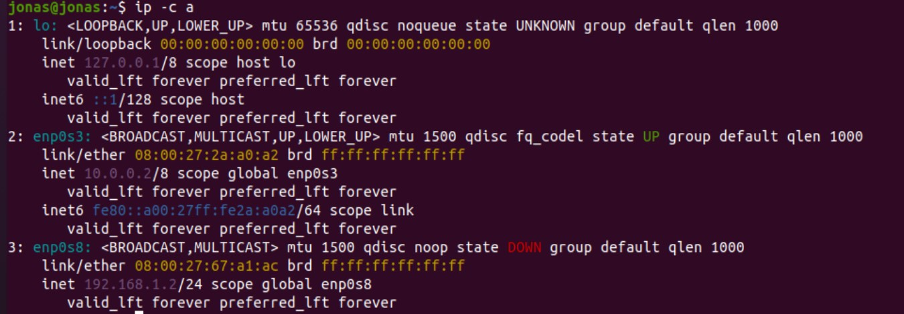


**Cli-ubuntu**:

	- **enps03: ip addr add 10.0.0.1/8 dev enp0s3**

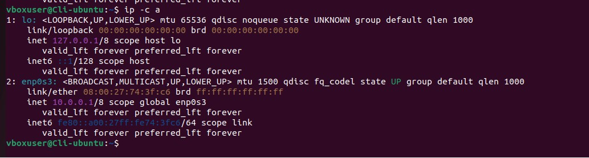


**Le bloc2: 192.168.1.0/24** est composé de **SRV-UBUNTU-2** et de **SRV-UBUNTU-3**.


**SRV-UBUNTU-2**:

	**enp0s3: ip addr add 192.168.1.3/24 dev enp0s3**

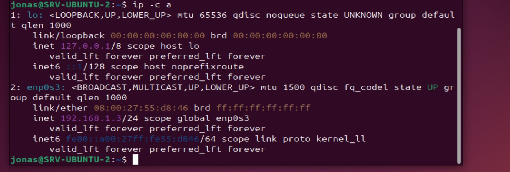


**SRV-UBUNTU-3**.

	**enp0s3: ip addr add 192.168.1.4/24 dev enp0s3**

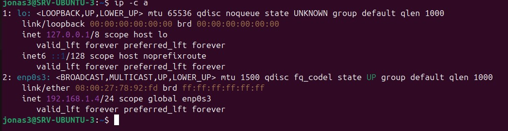


**Remarque :** ping v6 du lien local, ne pas oublier la mention de l'interface, **-l interface** ou **%interface**

* * *

**1.8 Vérifier via commande ping que les machines d'un même îlot peuvent se joindre.**


### Vérification Ilot1:

1. **ping 10.0.0.1**: **Cli-Ubuntu** depuis le **serveur-ubuntu**
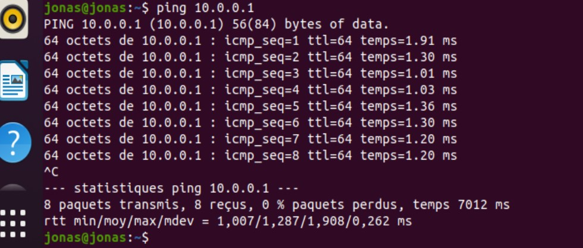

2. **ping 10.0.0.2: serveur-ubuntu** depuis le **Cli-Ubuntu**
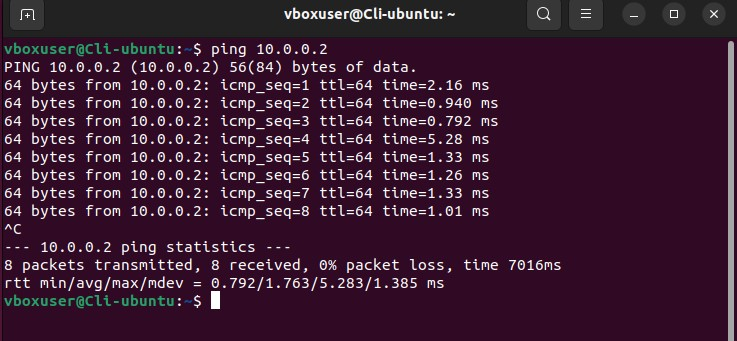


3. **ping 10.0.0.2: serveur-ubuntu** depuis le **Cli-Ubuntu**


### Vérification Ilot2:

1. **ping 192.168.1.3 SRV-UBUNTU-2** depuis le **SRV-UBUNTU-3**

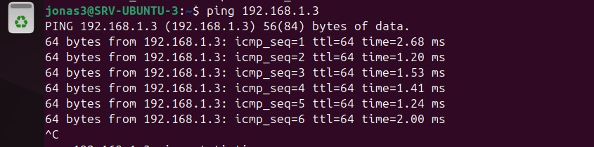

2. **ping 192.168.1.4 : SRV-UBUNTU-3** depuis le **SRV-UBUNTU-2**

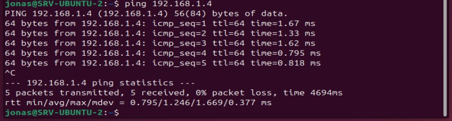


3. **ping 192.168.1.4 : SRV-UBUNTU-3** depuis le **SRV-UBUNTU-2**


* * *

**1.9 Que se passe t-il si 2 machines ont la même adresse IP ? Modifier la configuration réseau d'une  machine en reprenant la même adresse IP. Expliquer en vous aidant de l'outil d'analyse de trames Wireshark**

Le ping depuis **serveur-ubuntu** a ciblé **SRV-UBUNTU-2** et **SRV-UBUNTU-3** qui ont l'IP **192.168.1.4/24** 

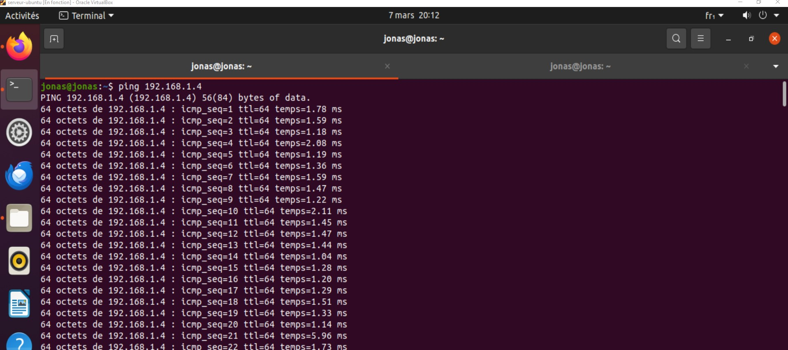


Les flux ont été observés plus intenses vers **SRV-UBUNTU-2** qui a répondu avec des requête.

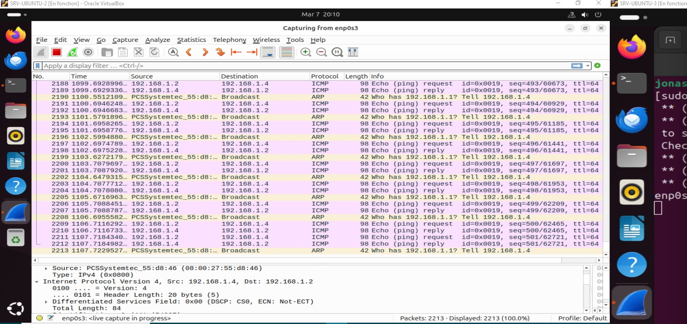


la machine 2 **SRV-UBUNTU-3** a été interrogée par le ping mais elle n'a pas répondu

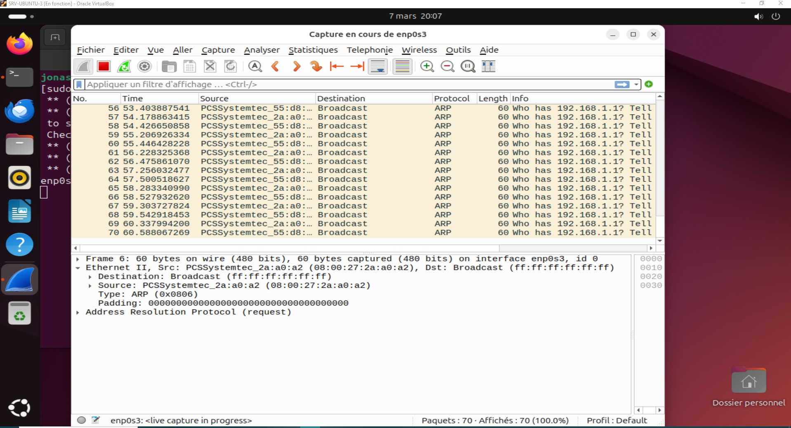


* * *


**1.10 Que se passe t-il si 2 machines ont la même adresse Ethernet ? Le changement d'adresse MAC s'effectue par commande `ip link set <interface> address <MAC address>`**

il est crucial que chaque machine sur un réseau ait une adresse MAC unique pour éviter des problèmes de communication.

Si deux machines sur le même réseau local ont la même adresse MAC, cela entraînera des conflits de communication et des problèmes de réseau. Voici ce qui peut se passer :


**1. Conflits de communication** : Les switchs et les routeurs utilisent les adresses MAC pour identifier les appareils sur le réseau. Si deux machines ont la même adresse MAC, les équipements réseau ne sauront pas où envoyer les paquets de données, ce qui entraînera des erreurs de transmission.

**2. Pertes de paquets**: Les paquets destinés à l'une des machines pourraient être envoyés à l'autre, ou simplement perdus, car le réseau ne pourra pas distinguer les deux appareils.

**3. Problèmes de connectivité :** Les deux machines pourraient avoir des difficultés à accéder au réseau, voire être complètement déconnectées.


**4. Instabilité du réseau**: Le réseau pourrait devenir instable, avec des interruptions de service pour d'autres appareils connectés.


<u>**Observation:**</u> 

Le changement d'adresse MAC est temporaire et sera réinitialisé au redémarrage de la machine. Pour le rendre permanent, vous devrez configurer le changement dans les scripts d'initialisation du système ou via des outils spécifiques à votre distribution.


Sur certains systèmes, vous devrez désactiver l'interface avant de changer l'adresse MAC :

```

sudo ip link set <interface> down

sudo ip link set <interface> address <nouvelle_adresse_MAC>

sudo ip link set <interface> up

```


<u>**Si 2 machines dans le monde ont la même adresse MAC**</u>

En théorie, si deux machines dans le monde ont la même adresse MAC, cela ne pose pas nécessairement de problème tant qu'elles ne sont pas sur le même réseau local. Voici une explication détaillée :

1. Les adresses MAC sont utilisées au niveau local

2. Problèmes si les machines sont sur le même réseau local

3. Adresses MAC uniques en théorie, mais pas toujours en pratique


Ce n'est pas vraiment gênant si deux machines dans le monde ont la même adresse MAC, à condition qu'elles ne soient pas sur le même réseau local. Cependant, sur un même réseau local, cela entraînera des conflits et des problèmes de communication. Pour éviter tout risque, il est préférable de s'assurer que chaque machine sur un réseau local ait une adresse MAC unique.


**<u>Remarque:</u>**

La commande `ethtool -p <interface>` permet d'afficher l'adresse originelle permanente.

* * *

**1.11 Vérifier le cache arp par la commande ip neigh show dev <interface>**

`ip neigh show dev enp0s3`

1. Client-Ubuntu 


2. Serveur-Ubuntu 
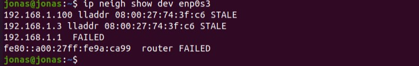


2. Serveur-Ubuntu 


**1.12 Vider les caches arp de chaque machine de l'ilot `(ip neigh flush dev <interface>`**

**1- Client-Ubuntu:**


**2. Serveur-Ubuntu:**


**2. Serveur-Ubuntu:**


**observation de l'échange complet « ping » avec l'outil wireshark**

En suivant ces étapes, nous pouvons observer le processus complet de résolution ARP et d'échange ICMP entre deux machines **Client-Ubuntu** et **Serveur-ubuntu**

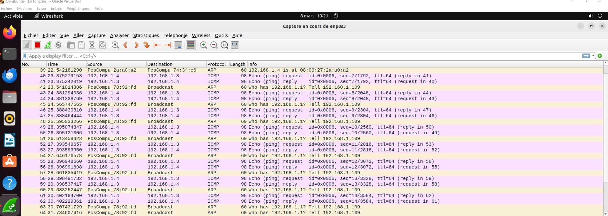


Détail:

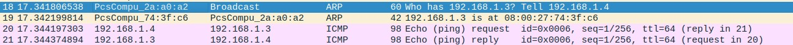


**1.13 Etablir le 'Sequence Diagram' des trames échangées lors d'un ping entre 2 machines d'un même ilot**


**<u>Explication:**</u>

 **1. Requête ARP (ARP Request)**

- **Source** : Machine A

- **Destination** : Broadcast (`ff:ff:ff:ff:ff:ff`)

- **Message** : "Who has `<IP_B>`? Tell `<IP_A>`."

- **Objectif** : La Machine A cherche à connaître l'adresse MAC de la Machine B.


**2. Réponse ARP (ARP Reply)**

- **Source** : Machine B

- **Destination** : Machine A

- **Message** : "`<IP_B>` is at `<MAC_B>`."

- **Objectif** : La Machine B répond avec son adresse MAC.


**3. Requête ICMP (Echo Request)**

- **Source** : Machine A

- **Destination** : Machine B

- **Message** : ICMP Echo Request (ping).

- **Objectif** : La Machine A envoie un paquet ICMP pour vérifier la connectivité avec la Machine B.


**4. Réponse ICMP (Echo Reply)**

- **Source** : Machine B

- **Destination** : Machine A

- **Message** : ICMP Echo Reply (pong).

- **Objectif** : La Machine B répond au paquet ICMP pour confirmer la connectivité.

- **Objectif** : La Machine B répond au paquet ICMP pour confirmer la connectivité.


